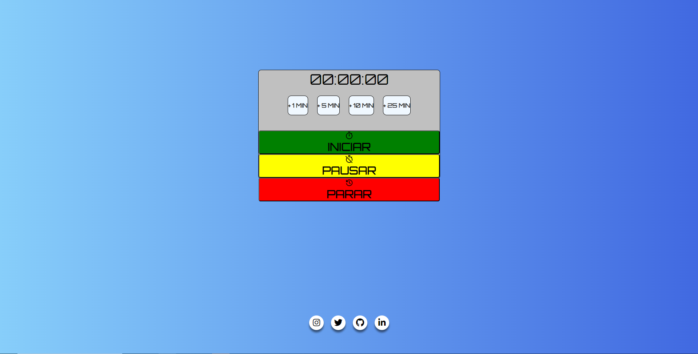

# Contador regressivo

## 📜 Índice
- <a href="#-descrição">Descrição</a>
- <a href="#-layout">Layout</a>
- <a href="#-tecnologias-utilizadas">Tecnologias utilizadas</a>

# 💭 Descrição
Desenvolvi um projeto simples, mas desafiador, para uma aplicaçaõ de estágio. Trata-se de um contador regressivo com funcionalidades adicionais. Com a interface intuitiva que criei, você encontrará quatro botões para adicionar tempos específicos e três botões para iniciar, pausar e parar o contador. <a>https://wesleymarques329.github.io/contadorRegressoJS/<a>

## 📲 Layout

 
 

## 🔧 Tecnologias utilizadas
 
1. HTML 
2. CSS 
3. JavaScript

